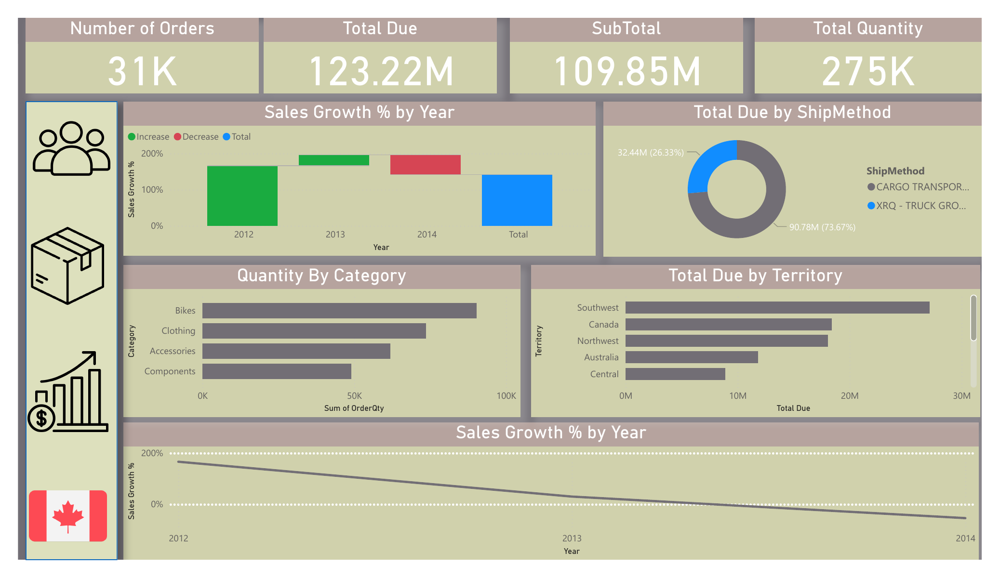
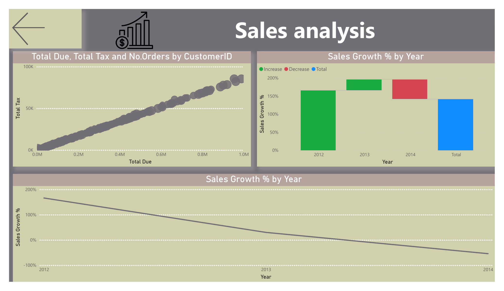
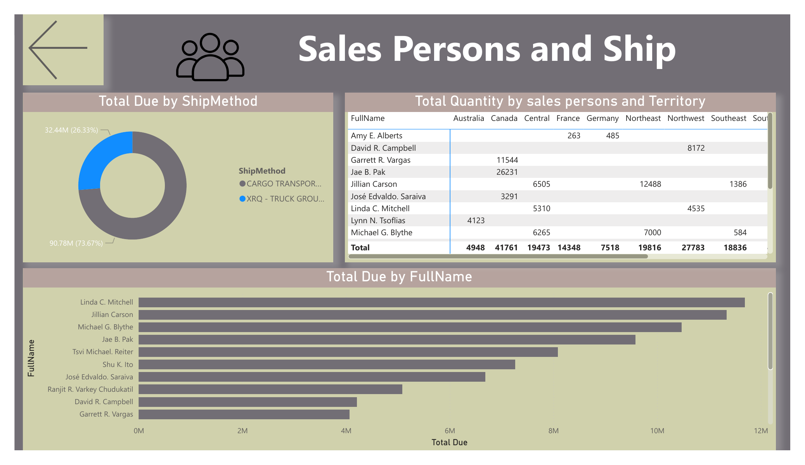

# 🚀 Sales Analysis Dashboard – Power BI Project

This project was developed during my journey at the **Information Technology Institute (ITI)** as part of the Power BI Development track.

## 📊 Project Overview
The **Sales Analysis Dashboard** provides an interactive view of company performance across territories, categories, and salespersons, enabling decision-makers to gain valuable insights into sales growth and trends.

---

## 📂 Dashboard Pages

1️⃣ **Sales Overview:**  
   - Displays main KPIs: *Total Due*, *Quantity*, *Orders*, and *Sales Growth (%)*  
   - Visuals include: *Sales Growth % by Year*, *Total Due by Territory*

2️⃣ **Category Analysis:**  
   - Drill-through page showing detailed analysis for product categories (*Bikes, Clothing, Components, Accessories*)

3️⃣ **Salespersons & Customers:**  
   - Shows *Total Due*, *Quantity*, and *Ship Method* per salesperson and territory

---

## ✨ Interactive Features
- **Drill-through navigation** from overview to detailed pages  
- **Bookmarks** for smooth navigation between report pages  
- A special **Canada flag 🇨🇦 bookmark** that instantly filters the entire report to show data for **Spain**

---

## 🧠 Skills & Tools
`Power BI` | `DAX` | `Data Modeling` | `Bookmarks` | `Drill-through` | `KPI Design`

---

## 📸 Dashboard Preview

Below are the main pages of the Sales Analysis Dashboard:

### 🧾 Sales Overview

---

### 📊 Category Analysis

---

### 👥 Salespersons & Customers

---

### 🧠 Product & Territory Analysis

---

## 📁 Dataset
The dataset used in this project simulates company sales records including product categories, territories, and salesperson performance.

---

## 🔗 Connect with Me
- **LinkedIn:** [Diaa Refat](https://www.linkedin.com/in/diaarefat7)
- **GitHub:** [DiaaRefat7](https://github.com/DiaaRefat7)
